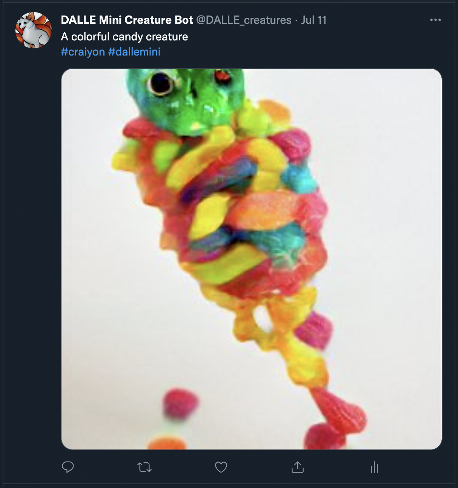

# DALLE-creature-bot
A Twitter bot that posts images of web-scraped creature prompts (from https://artprompts.org/creature-prompts/) generated with DALLE mini.

Visit it here! --> https://twitter.com/DALLE_creatures 

## General Information
- Uses BeautifulSoup to parse an art prompt from https://artprompts.org/creature-prompts/
- Uses Selenium to input prompt into https://www.craiyon.com/ (DALLE mini)
- Downloads one of the generated images and posts it to Twitter with its corresponding prompt

## Features/Packages
- Pulls Twitter API keys/tokens from local environment variables
-tweepy (python library to access Twitter API)
- BeautifulSoup (bs4)
- requests
- selenium

## Content

## License
This project is open source and available under the MIT License.
